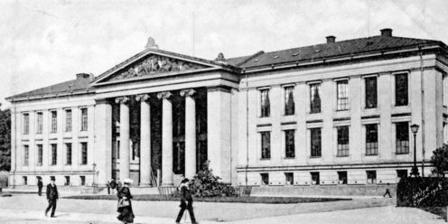
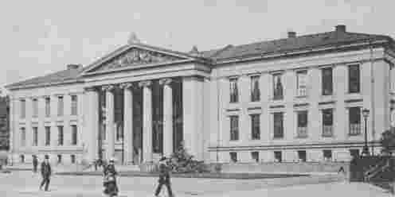
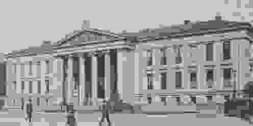

# Obligatorisk oppgave 2

- [Obligatorisk oppgave 2](#obligatorisk-oppgave-2)
- [Oppgave 1 - Implementasjon av konvolusjonsfilter i frekvensdomenet](#oppgave-1---implementasjon-av-konvolusjonsfilter-i-frekvensdomenet)
  - [Generelt](#generelt)
  - [Oppgave 1.1 og 1.2](#oppgave-11-og-12)
  - [Oppgave 1.2](#oppgave-12)
- [Oppgave 2 - Ikke-tapsfri JPEG-kompresjon](#oppgave-2---ikke-tapsfri-jpeg-kompresjon)
  - [Resultatbilder](#resultatbilder)

# Oppgave 1 - Implementasjon av konvolusjonsfilter i frekvensdomenet

## Generelt
Koden ligger vedlagt delivry. For å kjøre programmet brukes følgende

```
$ python3 oppgave1.py
```

Bildene og tidskurvene lagres i mappen der `oppgave1.py` kjøres.

## Oppgave 1.1 og 1.2

Originalbildet\


Resultatbilde fra romlig konvolusjon med 15x15 middelverdifilter\


Resultatbilde fra frekvensdomenet med 15x15 middelverdifilter\


## Oppgave 1.2

# Oppgave 2 - Ikke-tapsfri JPEG-kompresjon

## Resultatbilder
Originalbilde\


Rekonstruert uten kvantifisering\


Rekonstruert med kvantifiseringsfaktor q = 0.1\


Rekonstruert med kvantifiseringsfaktor q = 0.5\


Rekonstruert med kvantifiseringsfaktor q = 2\


Rekonstruert med kvantifiseringsfaktor q = 8\


Rekonstruert med kvantifiseringsfaktor q = 32\


