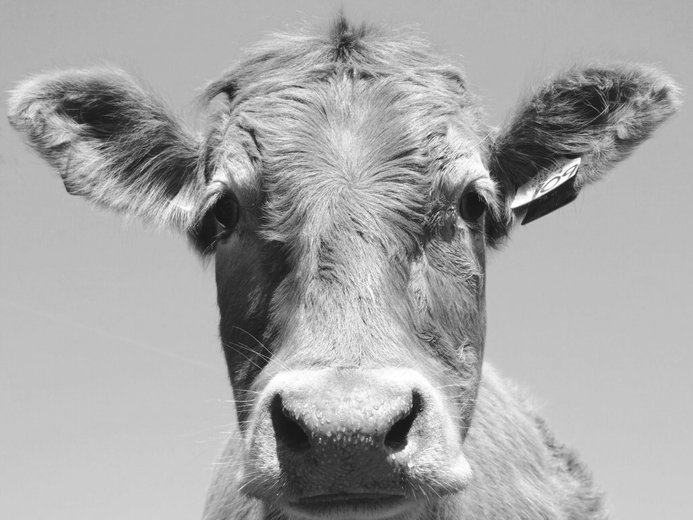
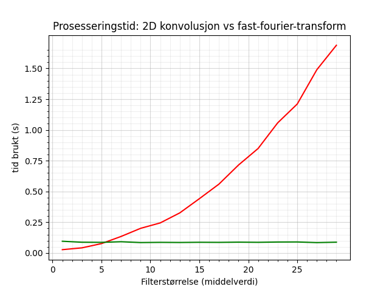
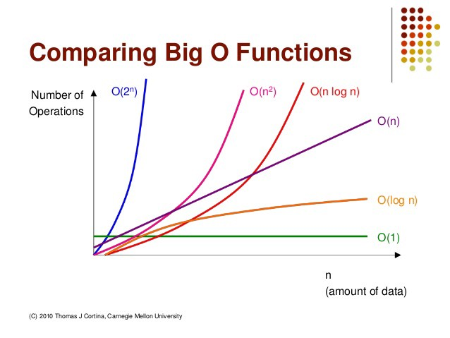
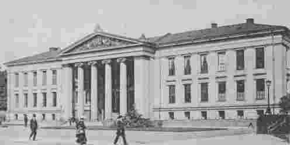

# Obligatorisk oppgave 2

- [Obligatorisk oppgave 2](#obligatorisk-oppgave-2)
- [Oppgave 1 - Implementasjon av konvolusjonsfilter i frekvensdomenet](#oppgave-1---implementasjon-av-konvolusjonsfilter-i-frekvensdomenet)
  - [Generelt](#generelt)
  - [Oppgave 1.1 og 1.2](#oppgave-11-og-12)
  - [Oppgave 1.2](#oppgave-12)
  - [Oppgave 1.3](#oppgave-13)
- [Oppgave 2 - Ikke-tapsfri JPEG-kompresjon](#oppgave-2---ikke-tapsfri-jpeg-kompresjon)
  - [Generelt om JPEG-kompresjon](#generelt-om-jpeg-kompresjon)
  - [Resultatbilder](#resultatbilder)
    - [Rekonstruert uten kvantifisering](#rekonstruert-uten-kvantifisering)
    - [Rekonstruert med kvantifiseringsfaktor q = 0.1](#rekonstruert-med-kvantifiseringsfaktor-q--01)
    - [Rekonstruert med kvantifiseringsfaktor q = 0.5](#rekonstruert-med-kvantifiseringsfaktor-q--05)
    - [Rekonstruert med kvantifiseringsfaktor q = 2](#rekonstruert-med-kvantifiseringsfaktor-q--2)
    - [Rekonstruert med kvantifiseringsfaktor q = 8](#rekonstruert-med-kvantifiseringsfaktor-q--8)
    - [Rekonstruert med kvantifiseringsfaktor q = 32](#rekonstruert-med-kvantifiseringsfaktor-q--32)
  - [a) Rekonstruksjonsfeil](#a-rekonstruksjonsfeil)
  - [b) Fremvisning av bilde](#b-fremvisning-av-bilde)
  - [c) Kompresjonsfaktor q og kompresjonsraten](#c-kompresjonsfaktor-q-og-kompresjonsraten)

# Oppgave 1 - Implementasjon av konvolusjonsfilter i frekvensdomenet

## Generelt
Koden ligger vedlagt delivry. For å kjøre programmet brukes følgende

```
$ python3 oppgave1.py
```

Bildene og tidskurvene lagres i mappen der `oppgave1.py` kjøres.

## Oppgave 1.1 og 1.2

**Originalbildet**\


**Romlig konvolusjon med 15x15 middelverdifilter**\


**Frekvensdomenet med 15x15 middelverdifilter**\


## Oppgave 1.2

En sirkelkonvolusjon i bildedomene er ekvivalent med elementvis multiplikasjon i frekvensdomene. Det er dette som gjør at vi kan designe filter i bildedomene for deretter og transformere det til frekvensdomene, og visa-versa. Det er viktig at innbilde og filteret er av samme dimensjon. Derfor blir ofte filteret null-utvidet. Men grunnet at det er en sirkelkonvolusjon må bildet også nullutvides for å håndtere randen. Når man bruker DFT antar man implisitt en periodisitet i innbildet, som kan gi en konsekvens av hvordan resultatbildet blir. En slik konsekvens kan være en translasjon av bilde, slik som var tilfellet i denne oppgaven. Man ser også at randen av bildene er ulike. I den romlige konvolusjonen er bildet nullutvidet, og derfor får man en "svart" kant som rammer bildet. Dersom man hadde nullutvidet bilde ville man kunne fjerne den translatoriske konsekvensen av den implisitte periodisiteten.

## Oppgave 1.3 

Fast-fourier-tranformen, som utnytter 2D DFT er separabelt, har en kjøretid O(N log N), mens romlig konvolusjonsfiltrering O(n²). Det betyr at for store filter vil en filtrering i frekvensdomene være raskere, fordi (n² >> log N).

**Kjøretidskurver**


**Kommentar til kjøretid:**\
Fra grafen ser man den romlige konvolusjonen øker med jo større filteret blir, med formen til n². Dersom filteret er lite, dvs mindre enn 4x4, så vil romlig konvolusjon være raskere. For de andre filterverdiene er fast-fourier-transformen raskest. 

Tidskurven til fast-fourier-transformen var ikke som forventet. Jeg hadde trodd at den skulle øke mer før den stabiliserte seg. Mulig jeg gjort feil når jeg tok tiden, men gjorde likt på begge testene. Derfor kan resultatet mitt avvike fra virkeligheten, og det kan tenkes at romlig konvolusjon er raskere for litt større filter. Men det er helt sikkert at fast-fourier-transform er raskest for store filter, grunnet log n.

Har lagt ved et utsnitt av koden under:

```
print("Starting timing process")
for i, n in zip(range(values.shape[0]), values):
    h = mean_value_kernel(n)
    
    start = time.time()
    fh = signal.convolve2d(f,h,'same')
    conv_time[i] = time.time()-start
    
    start = time.time()
    FH = fast_fourier(f,h)
    freq_time[i] = time.time()-start
```
Eksempel på kjøretider:\



# Oppgave 2 - Ikke-tapsfri JPEG-kompresjon

## Generelt om JPEG-kompresjon
Kompresjonsmetoden brukt i denne oppgaven er som tittelen sier ikke-tapsfri eller "lossy" kompresjon. Det er mulig å oppnå en kompresjonsrate på 30, med akseptabel reduksjon i bildekvalitet. JPEG deler innbilde opp i flere 8x8 blokker, der hver blokk transformeres med en diskret cosinus transform (DCT). Hensikten med å dele opp bilde og utføre DCT på hver blokk er å samle informasjonen til de 64 pikslene i en liten del av de 64 DCT-koeffsientene. Vi vil oppleve at flere av de 64 DCT-koeffisientene vil være tilnærmet 0, noe som gjør at vi kan komprimere bilde med koding, ofte huffmann. 

Etter 2D DCT-transformasjonen vil de høyeste verdiene finnes i øverste venstre hjørne av DCT-koeffsienetene. Verdien av koeffisientene sier noe om hvor mye hver koeffisient er tilstede i originalbilde. Vi sier pikselverdiene er transformert.

Neste steg er å dividere DCT-koeffisientene med vekt-matrise, dette gir opphav til en "lossy" kompresjon fordi vi runder til nærmeste heltll. I JPEG kompresjon er det ofte brukt en standard vekt-matrise (som også brukes i denne oppgaven). Ved å dividere på med vektmatrisen og runde til nærmeste heltall vil vi få en resultatmatrise med høye verdier i øverste venstre høyrne og resten er oftes 0. Vi sier pikselverdiene er kvantifisert.

Steget etter dette er å utføre en sikk-sakk-skanning, der de største verdiene kommer først i rekka og blir etterfulgt av flere 0'ere. En slik rekke egner seg ypperlig til å utføre løpelengdetransformasjon av de transformerte og kvantifiserte verdiene. Etterpå blir disse løpelengende kodet ved hjelp av huffman-koding. Huffman-koden og kodeboken sendes deretter til mottaker, i en komprimert tilstand. Dette ble ikke gjort i denne obligen. 

Ved å bruke kodeboken kan mottaker dekode kodeordene og reversere løpelengdetransformene. Dette vil gi mottaker samme tallrekke som ble laget i sikk-sakk-skanningen. Deretter kan mottaker mulitiplisere med samme vektmatrise (kvantifiseringen) og ender opp med samme resultat.

## Resultatbilder
Resultatbilder og estimert kompresjonsdata med kompresjonsfaktor, q = [0.1, 0.5, 2, 8, 32].

### Rekonstruert uten kvantifisering


### Rekonstruert med kvantifiseringsfaktor q = 0.1


Estimert kompresjonsinformasjon:
```
"uio.png" with q=0.1 
Find entropy of compressed image (H), entropy of original image (b), 
storage, compressionrate (CR) and percetage removed (PR) after JPEG-compression with q=0.1: 
Pixel intensities range from -711.0 to 663.0, which gives a range G = 1375.0 
H = 3.879b storage = 60.0kB 
CR = 2.062 
PR = 51.507% 
```
### Rekonstruert med kvantifiseringsfaktor q = 0.5


Estimert kompresjonsinformasjon:
``` 
"uio.png" with q=0.5 
Find entropy of compressed image (H), entropy of original image (b), 
storage, compressionrate (CR) and percetage removed (PR) after JPEG-compression with q=0.5: 
Pixel intensities range from -142.0 to 133.0, which gives a range G = 276.0 
H = 2.107b storage = 32.0kB 
CR = 3.797 
PR = 73.666%
```

### Rekonstruert med kvantifiseringsfaktor q = 2


Estimert kompresjonsinformasjon:
```
"uio.png" with q=2 
Find entropy of compressed image (H), entropy of original image (b), 
storage, compressionrate (CR) and percetage removed (PR) after JPEG-compression with q=2: 
Pixel intensities range from -36.0 to 33.0, which gives a range G = 70.0 
H = 1.088b storage = 17.0kB 
CR = 7.351 
PR = 86.396% 
```
### Rekonstruert med kvantifiseringsfaktor q = 8


Estimert kompresjonsinformasjon:
```
uio.png" with q=8 
Find entropy of compressed image (H), entropy of original image (b), 
storage, compressionrate (CR) and percetage removed (PR) after JPEG-compression with q=8: 
Pixel intensities range from -9.0 to 8.0, which gives a range G = 18.0 
H = 0.49b storage = 8.0kB 
CR = 16.335 
PR = 93.878% 
```

### Rekonstruert med kvantifiseringsfaktor q = 32


Estimert kompresjonsinformasjon:
```
uio.png" with q=32 Find entropy of compressed image (H), entropy of original image (b), 
storage, compressionrate (CR) and percetage removed (PR) after JPEG-compression with q=32: 
Pixel intensities range from -2.0 to 2.0, which gives a range G = 5.0 
H = 0.18b storage = 3.0kB 
CR = 44.528 
PR = 97.754%
```

## a) Rekonstruksjonsfeil

"Blokk-artefakter" er et kjent fenomen når man bruker JPEG-komprimering. Denne feilen oppstår på grunn av den 8x8 blokk-oppdelingen av bildet. En annen kjent feil den såkalte Gibbs-effekten. Gibbs-effekten kan gi sløring og dobbelkonturer i skarpe kanter (endring i pikselintensitet). Disse feilene er borte i nyere standarder av JPEG kompresjon, der DCT er erstattet med "wavelets". 

Vi kan se tilfeller av disse feilene i resultatbildene. Allerede med en kompresjonsfaktor lik 2 ser man tendenser til "blokk-artefakter" i skyene og glatting. Disse feilene blir mer enda mer synlig ved kompresjonsfaktor 8 og 32, som er naturlig. Jeg observerte ikke noe form for ringing. En grunn til dette er at originalbilde i seg selv er av ganske lav oppløsning.

## b) Fremvisning av bilde
Hvilken kompresjonsfaktor som er ok for å vise bilde baserer seg veldig mye på hva bilde skal brukes til. Jeg vil si at det rekonstruerte bilde med kompresjonsfaktor lik 8 er god nok til å vise på en dataskjerm der detaljnivået ikke er viktig. Du ser tydelig hva bildet inneholder. Derimot skulle det ble vist frem der behovet for mer detaljer er tilstedet, ville jeg ikke hatt en høyere kompresjonsfaktor enn 2. 

## c) Kompresjonsfaktor q og kompresjonsraten

Kompresjonsraten CR er definert som forholdet mellom b; det faste antallet bits per symbol i det ukomprimerte bildet/datamengden og c; som er det gjennomsnittlige antallet bits per symbol i det komprimerte bilde/datamengden. Når c minker, dvs at vi kan representere en piksel med mindre antall bits, vil kompresjonsraten øke fordi b er en fastsatt verdi.

```
CR = b / c
```

For å finne det gjennomsnittlige antall bits per symbol en datamengde har, må man:
1. Lage en kodebok, 
   1. Finner antall forekomster, `n_i`, av symbolet `s_i` i en sekvens av `N` symboler. 
   2. Hvert symbol får sitt eget kodeord `c_i` der `b_i` er lengden av kodeordet i antall biter.
2. Alle symbolene av typen `s_i` vil dermed bidra med `n_i * b_i` biter i den totale kodesekvensen.

Når vi har et mål på antall biter brukt per symbol kan vi også finne det gjennomsnittlige antall biter per symbol i datamengden. Det gjøres ved å finne summen av alle bidragene og deretter dividere på hele sekvensen. 

```
G = range of pixelintensities
c = 0
for i=0 to G-1:
    c += b_i*n_i
c = c/N
```

La oss se på eksempelet med et gråtonebilde. Et gråtonebilde bruker 8bits per piksel, som gir b = 8. Etter en JPEG kompresjon har vi fjernet "unødig" informasjon fra bildet, gjennom kvantifiseringen. Kvantifiseringen beholder verdier som bidrar til bildets struktur, mens den fjerner mindre viktige detajler, som gjør at vi trenger mindre antall bits per piksel. Det fører til at c vil minke.

Kvantifiseringen skjer ved å dividere DCT-koeffisientene med en kjent vektmatrise. Dersom vi øker q, øker også verdiene i vektmatrisen. 

I vårt tilfellet antar vi at entropien til det komprimerte bilde tilsvarer antall bits per symbol vi får etter kompresjonen. Entropi er et matematisk mål på gjennomsnittlig informasjonsmengde i en sekvens av tall eller tegn. Det er ønskelig at det gjennomsnittlige antall biter vi bruker per symbol skal være lik entropien til meldingen.

